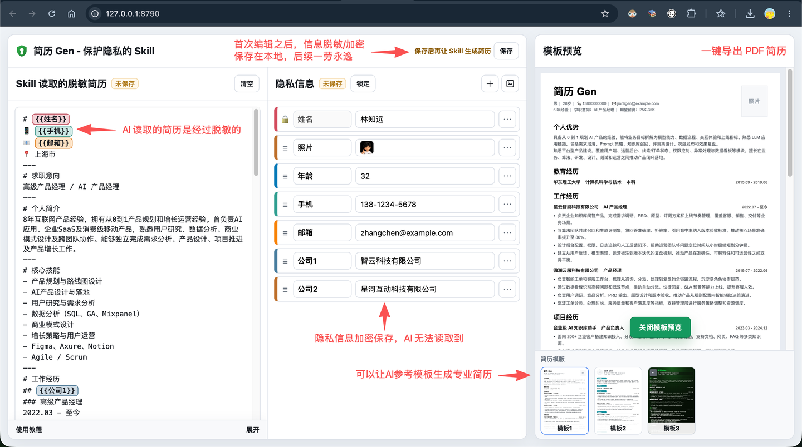
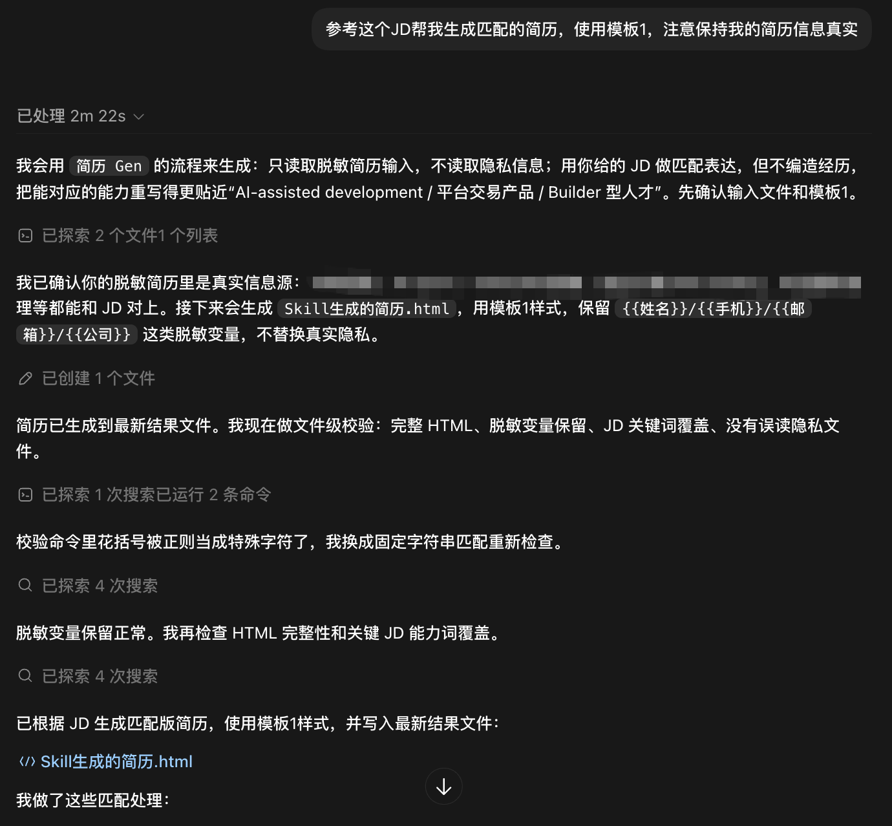

# 简历 Gen


一个保护隐私的简历生成 Skill。你可以把真实姓名、电话、邮箱、照片、公司名称等信息单独保存，只让 Skill 读取脱敏后的简历内容，再生成可预览、可导出的专业简历 PDF。

## 适合场景

- 用同一份简历内容生成不同风格的简历
- 根据 JD 改写简历，但保留真实经历和脱敏变量
- 不希望把隐私信息直接暴露在简历正文或对话里
- 需要在网页里预览简历，并导出为 PDF

## 安装与启动

将这个仓库作为通用 Skill 安装到支持 Skill 的 AI 工具后，可以直接让 AI 帮你完成安装和启动。比如：

```text
使用 jianli-gen 这个 Skill，帮我安装依赖并启动本地简历应用
```

AI 会按 Skill 说明安装网页应用依赖、构建前端，并启动本地服务。启动完成后打开：

```text
http://127.0.0.1:8790
```

如果你想手动执行，也可以运行：

```bash
npm --prefix app install
npm --prefix app run build
node server/server.mjs
```



## 使用流程

1. 在网页里填写或粘贴 `Skill 读取的脱敏简历`。
2. 在 `隐私信息` 中保存姓名、照片、手机、邮箱、公司等真实信息。
3. 选择一个简历模板。
4. 让支持 Skill 的 AI 工具使用 `jianli-gen` 生成简历。
5. 回到网页点击 `查看最新`，预览满意后导出 PDF。



## 隐私说明

Skill 正常生成时只读取脱敏简历和模板，不读取隐私信息文件。隐私信息由本地网页应用在需要时处理，生成结果会保留 `{{姓名}}`、`{{手机}}` 这类变量或在本地预览时替换。

请不要把真实隐私信息直接写进脱敏简历正文。

## 更新

如果你通过 GitHub 安装这个 Skill，可以让支持 Skill 的 AI 工具帮你更新仓库、重装依赖并重启服务：

```text
使用 jianli-gen 这个 Skill，帮我更新到 GitHub 最新版本并重新启动服务
```

手动更新时，拉取或重新安装仓库的最新版本即可。更新后建议重新启动本地服务，并开启新的 AI 会话或重新加载 Skill，让元数据和说明生效。

```bash
git pull
npm --prefix app install
npm --prefix app run build
node server/server.mjs
```

## 仓库

[Raydon10/jianli-gen](https://github.com/Raydon10/jianli-gen)
